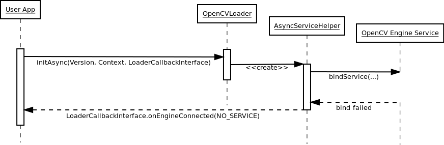
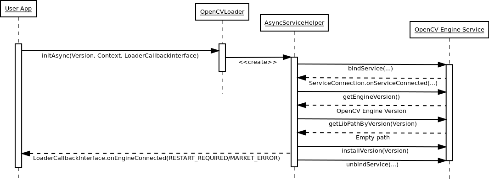
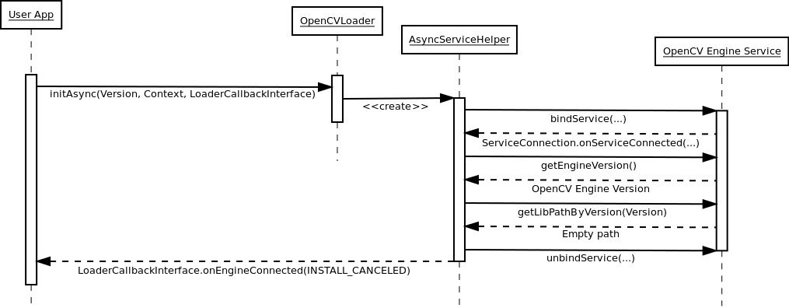
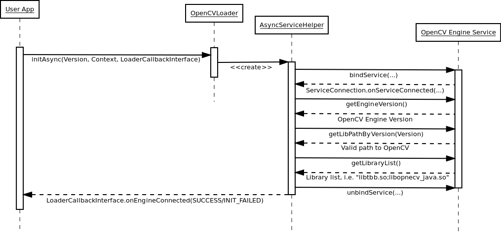

*******************************************
Engine use Cases
*******************************************

First application start
-----------------------

There is no OpenCV Engine and OpenCV libraries.

Second application start
------------------------

There is OpenCV Engine service, but there is no OpenCV library.
If OpenCV library installation aproved\:

If OpenCV library installation canceled\:

Regular spplication start
-------------------------

OpenCV Engine and OpenCV library has bee already installed.

