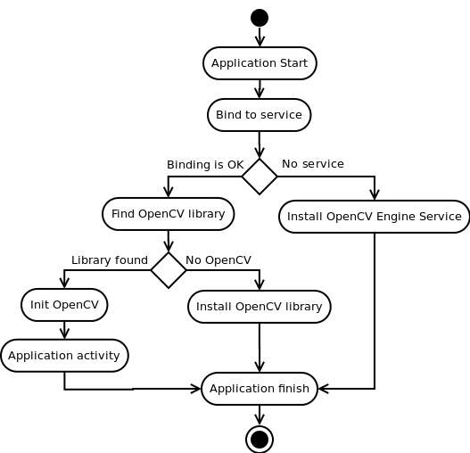

**************************************
Android OpenCV Engine
**************************************

.. highlight:: java

Usage model for target user
---------------------------

First OpenCV app\:

- User downloads app dependent from OpenCV from Google Play or installs it manually;
- User starts application. Application asks user to install OpenCV Engine;
- User installs OpenCV Engine from Google Play Service;
- User starts application. Application proposes to user to install OpenCV library for target device and runs Google Play;
- User runs app in the third time  and gets what he or she wants.

Next OpenCV app:

- User downloads app dependent from OpenCV from Google Play or installs it manually;
- User starts application.
- If selected version is not installed Engine asks user to install OpenCV library package and runs Google Play;
- User runs app in the second time and gets what he or she wants.

Development environment setup
-----------------------------

To develop OpenCV-dependent application you firstly need to setup environment. Find manual here: http://opencv.itseez.com/doc/tutorials/introduction/android_binary_package/android_binary_package.html. If you want to use OpenCV as dynamic library in old-fashion that's all you need. Go to the next chapter. If you want to use new engine-based aproach you need to install packages with the Service and OpenCV package for you platform. You can do it using Google Play service or manualy with adb tool:

.. code-block:: sh
    :linenos:

    adb install ./org.opencv.engine.apk
    adb install ./org.opencv.lib_v240_<hardware version>.apk

After packages instalation remove native libs from OpenCV library.  After this steps your computer is ready for Application development.

Application development with static initialisation
--------------------------------------------------

This way is depricated for production code. It is designed for experimantal and local development purposes only. If you want to publish your app use aproach with async initialisation. 
In this case you need to add OpenCV library initialization before using any OpenCV specific code, for example, in static section of Activity class.

.. code-block:: java
   :linenos:

    static {
        if (!Helper.InitOpenCVStatic()) {
            // Report initialisation error
        }
    }

If you application includes other OpenCV-dependent native libraries you need to init OpenCV before them.

.. code-block:: java
    :linenos:

    static {
        if (Helper.InitOpenCVStatic()) {
            System.loadLibrary("my_super_lib1");
            System.loadLibrary("my_super_lib2");
        } else {
            // Report initialisation error
        }
    }

In this case you do not need to put library version in init method. You just need to add all OpenCV native libs in your app package.

Application development with async initialisation
-------------------------------------------------

This way of using OpenCV libary is recomended. There is a very base code snippet for Async init. It shows only basis principles of library Initialisation.

.. code-block:: java
    :linenos:
    
    public class Myctivity extends Activity implements HelperCallbackInterface
    {
	/** Called when the activity is first created. */
	@Override
	public void onCreate(Bundle savedInstanceState)
	{
	    Log.i(TAG, "onCreate");
	    super.onCreate(savedInstanceState);

	    requestWindowFeature(Window.FEATURE_NO_TITLE);

	    Log.i(TAG, "Trying to load OpenCV library");
	    if (Helper.Success != Helper.InitOpenCVAsync("2.4", this, this))
	    {
		Log.e(TAG, "Cannot connect to OpenCVEngine");
		finish();
	    }
	}

	public void OnEngineConnected(int status)
	{
	    switch (status)
	    {
		case Helper.Success:
	    {
		    Log.i(TAG, "OpenCV loaded successfully!");
		    mView = new MyView(this);
		    setContentView(mView);
		} break;
		case Helper.RestartRequired:
		{
		    Log.d(TAG, "OpenCV downloading. App restart is needed!");
		    finish();
		} break;
		default:
		{
		    Log.e(TAG, "OpenCV loading failed!");
		    finish();
		} break;
	    }
	}
    }

It this case application works with OpenCV Engine in async fashion. OnEngineConnected callback will be called in UI thread, when initialisation finishes. Attension, It does not allowed to use CV calls or load OpenCV-dependent native libs before invoking this callback. Application also need to handle NoService and MarketError status values.
